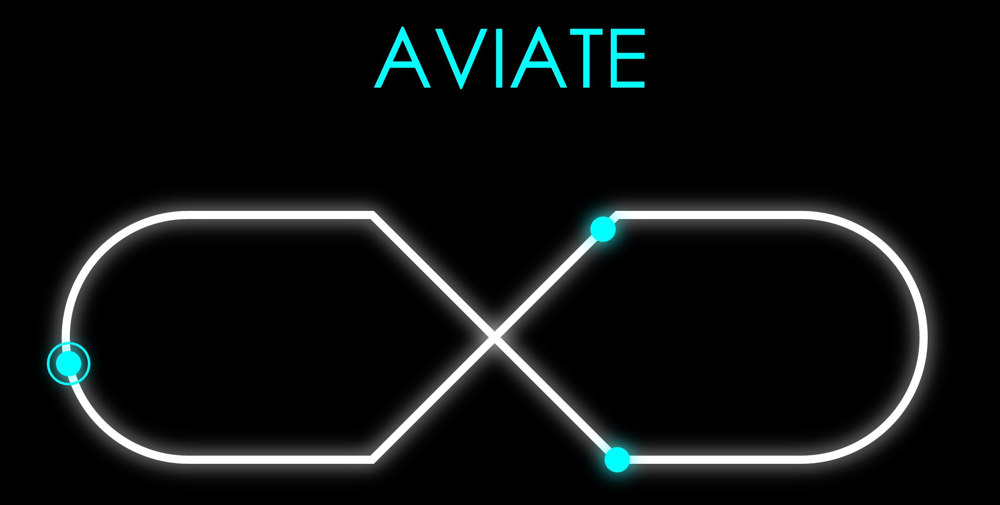

# Aviate

@HackPKU 2016 First Price Winner Project.

A real-time multi-player music game with multi-platform support.

Watch demo video online: [part1](http://v.youku.com/v_show/id_XMTUzMTg1MTA3Ng==.html?from=y1.7-1.2) & [part2](http://v.youku.com/v_show/id_XMTUzMTg1MjIyOA==.html?from=y1.7-1.2).

For demo video download & behind the hack & more, click [here](http://pan.baidu.com/s/1dFLOZpJ).

### Tech

* Frontend: paper.js (HTML5 canvas)
* Backend: Node.js
* Hardware: Kinect for Windows + Raspberry Pi
* Networking: WebSocket + Raw TCP

### Team

* [wxygeek](https://github.com/wxygeek) (Team Leader & Frontend)
* [skyline75489](https://github.com/skyline75489) (Frontend & Backend)
* [zhaoguoquan94](https://github.com/zhaoguoquan94) (Kinect & Visual Design)
* [TuringMacLee](https://github.com/TuringMacLee) (Raspberry Pi & Visual Design)